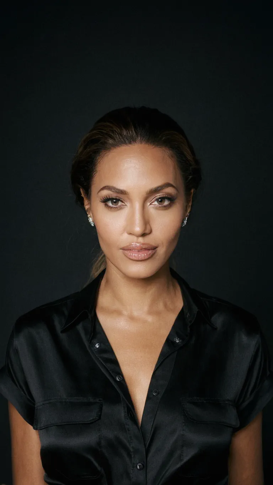

import ImageGrid from '@/components/ImageGrid.astro'
import ImageDiff from '@/components/ImageDiff.astro'
import ImagePreview from '@/components/ImagePreview.astro'

<ImagePreview />

## The Basics

**The model** you choose has the most significant impact on the quality of the generated images.
It's very important to choose the right model for the work you want to do.
There are models trained to generate realistic images of people, general models that can generate anything, models targeted at generating anime or cartoon styles, and many more. You can find them on popular website [CivitAI.com](https://civitai.com/models?ref_code=ADD-THI).
In case of Realistic Person Generation, I recommend using [RealVis](https://civitai.com/models/139562?modelVersionId=789646), [ZavyChroma](https://civitai.com/models/119229?modelVersionId=641087) and [CHINOOK](https://civitai.com/models/400589?modelVersionId=495482). The first one is my personal favorite at moment of writing this article. 
Every model has its own strengths and weaknesses. You need to find the one that suits your needs best.

The second most important factor are **the prompts** you write. Positive and Negative.
They have impact on the appearance of the generated person and the overall quality of the image.
If you don't specify exactly how the generated person should look, they will most likely resemble those on which the model was trained.
I don't remember how many times I've seen people talking on [Reddit](https://www.reddit.com/r/StableDiffusion/) about seeing the same faces in generated images. 
You have many possibilities to manipulate the appearance of the generated person using just prompts.
Starting from the face shape, through the hair style, skin tone, body type, specific body parts, age, nationality, and more.

The third factor is **configuration**. 
[Image resolution](https://en.wikipedia.org/wiki/Image_resolution), [Sampler](https://stable-diffusion-art.com/samplers/), number of [Sampling Steps](https://getimg.ai/guides/interactive-guide-to-stable-diffusion-steps-parameter), [Guidance Scale](https://www.reddit.com/r/StableDiffusion/comments/xdvgyn/i_made_a_comparison_table_between_steps_and/) and [Variational Autoencoder (VAE)](https://wiki.civitai.com/wiki/Variational_Autoencoder) are the most important things in the configuration. 
Each of them has a huge impact on the final image. Higher resolution means more details will be visible. 
It's like giving artist a bigger canvas to paint on. 
Sampler has control over image generation process and each sampler can produce different results.
More Sampling Steps means more details will be rendered. Skin and clothes will have better textures. 
More objects will appear on generated image. Guidance Scale is a multiplier for the influence of the prompts on the final image. 
So, with higher Guidance Scale, the prompts will have more impact on the final image.
VAE is responsible for the quality of the generated image. 
In case of SDXL, [standard VAE](https://huggingface.co/stabilityai/sdxl-vae) should be fine.

## Negative Prompt

Let's start with the negative prompt and then move on to the positive prompts.
The Negative Prompt is not just for specifying objects that should not appear in the generated image, but it can also have an impact on the quality of the generated image.
They are not required, but from my experience, they help. In my own works I prefer to use [Negative Embeddings](https://wiki.civitai.com/wiki/Embedding) - because they are more convinient to use. 
I can recommend you to use [NDXL](https://civitai.com/models/454470/negative-dynamics-xl), [FiXL](https://civitai.com/models/385105/fixl?modelVersionId=429806) or [ACNeg1](https://civitai.com/models/148131?modelVersionId=166373) (you can mix them, but using only one should be enough). 
Anyway, for the purpose of this article, let's create short Negative Prompt. We will specify what we don't want to see in the generated image. 

```
worst quality, low quality, low resolution, painting, illustration, cartoon, sketch, 3d, 2d, blurry, grainy, pixelated, distorted, poorly drawn, bad anatomy, unrealistic proportions, text, watermark, signature, error, artifact
```

Below you can see the difference between the image generated without Negative Prompt (left side) and the image generated with Negative Prompt (right side).

<ImageDiff>
  
  
</ImageDiff>

## Positive prompt - What we want to generate

Let's generate a photography of a real person. 
Let the woman be the subject of our work and let's start our positive prompt by specifying that we want to generate a photography of a woman. 
Prompting hard on the photography types will help us to generate a realistic image. 


Example:

> photoshoot, photo studio, RAW photo, editorial photography, film stock photography, a photography of a woman

Keep in mind that:
- Different models might work with different keywords. Always check the documentation of the model you are using.
  Some models might react more to the specific keywords than others.
- Using `Realistic` keyword might make your person look less realistic. That's because the model might think that you want to generate a realistic painting or illustration. It's better to avoid this keyword.

We have basic stuff covered. We can move on to the modifications.

## Face Features

You can specify all the face features you want to modify. Starting from the face shape, through the eyes, nose, mouth, ears, chin, cheeks, forehead, eyebrows, freckles, moles, scars, wrinkles, facial hair and ending on expressions (hope I didn't forget anything). 
You can describe them in a way that you want them to be. 

Examples: `oval face shape`, `bushy eyebrows`, `big eyes`, `wide nose`, `full lips`, `double chin`, `freckles on the cheeks`, `wrinkles around the eyes`.

<ImageGrid>
  
  
  
  
</ImageGrid>

## Makeup

You can specify the makeup style you want to see on the generated person.
Makeup can affect the face, hair, clothes and even the scenery. A lot depends on keywords you use.

You can specify individual things like `red lipstick`, `pink eyeliner`, `eyeshadow`, `lip gloss`, `eyebrow pencil`, `highlighter`, `contour`, `bronzer` and this should not affect the generated image too much.

Prompting makeup styles like `natural makeup`, `glam makeup`, `gothic makeup`, `retro makeup`, `shimmer makeup` might have impact on things not related to the face.

Below you can see how prompting makeup can affect the generated image. `Anti-aging Makeup` automatically generated older woman. 
`Shimmer Makeup` affected clothes. `Prom Makeup` made the woman look younger. `Retro Makeup` affected the hairstyle and colors of the image.

<ImageGrid>
  
  
  
  
</ImageGrid>

## Hair Style and Color

Good thing is that Stable Diffusion knows some hair styles. But probably you don't know them. 
You can ask AI for the list, browse the internet, read some fashion magazines or just find the [list that already exists](https://github.com/Avaray/stable-diffusion-simple-wildcards/blob/sdxl/wildcards/hairstyles.txt). When you find the name of the hair style you like, you can use it in the prompt, combining it with the color (if you want).

Examples: `braided wrap-around ponytail`, `short curly hair`, `blonde double bun`, `twisted bangs`, `pink dreadlocks` or something simple like `long dark hair`.

Keep in mind that:
- Unnatural hair colors (like blue, yellow, green, etc.) are harder to generate. You can read [this section](/using-prompts-to-modify-face-and-body-in-stable-diffusion-xl#results-are-not-satisfying) to find out how to get better results.
- Prompts containing specific words like `pearl`, `orange` or `pineapple` might generate these objects instead of affecting the hair. Don't be surprised if you see woman holding oranges instead of having orange hair.

<ImageGrid>
  
  
  
  
</ImageGrid>

## Skin

You can describe the skin tone, texture, and any other skin features you want to see.

Examples: `dark skin`, `pale skin`, `detailed skin texture`, `freckles on the skin`, `freckles on the shoulders`, `tan`, `tan lines`, `saggy skin`, `wet skin`, `tattoos`, `scars`, etc.

## Body Type

You can modify the body type in three ways. 

1. By describing the person's profession like: `athlete`, `sumo wrestler`, `bodybuilder`.
2. By specifying the body type like: `slim body type`, `chubby body type`, `muscular body type`. 
3. By specifying individual body parts like: `long legs`, `big belly`, `muscular arms`.

I believe that you never seen sumo wrestler without big body weight or bodybuilder without muscles. Things are related. So you can make the generated person looks muscular by specifying that he is a bodybuilder for example. But then you need to prompt the clothing that bodybuilder would wear and the place where he would be. Because with the bodybuilder profession, sport clothes and gym in the background are more likely to appear in the generated image.

Specyfying the body type or individual body parts is a bit better than specyfying the profession. Because it does not affect clothing and background.
Stable Diffusion understands the body types and body parts. Just open your imagination and describe that as you want.

<ImageGrid>
  
  
  
  
</ImageGrid>

## Nationality and Ethnicity

Stable Diffusion was trained on images of people from all over the world. So it knows how people from different countries look like. 
Depending on the region of the world people will look different.
Prompting Nationalities and Ethnicities is connected with the skin tone, facial features and body types. 
And that's not all. People from different countries have different clothing styles, hair styles, etc.
The scenery where they live is also different. 

You can specify nationality like: `Japanese`, `Spanish`, `Somalian`.  
And ethnicity like: `Asian`, `European`, `African`.

You can get large list of nationalities [from this file](https://github.com/Avaray/stable-diffusion-simple-wildcards/blob/sdxl/wildcards/nationalities.txt). That list was inspired by [this Reddit post](https://www.reddit.com/r/StableDiffusion/comments/13oea0i/photorealistic_portraits_of_200_ethinicities/).

<ImageGrid>
  
  
  
  
</ImageGrid>

## Age

Prompting age might be a bit tricky, because age is connected with some other features. 

If you want to generate an **old person**, you can prompt `old woman`, `old lady` or `grandma`. 
She will most likely have wrinkles, saggy skin, grey hair, and wear clothes that are typical for old people. She will most likely be in the scenery that is typical for old people, like a porch or a living room.
To increase the chance that the generated person will look old, you can specify features like: `old lady, wrinkles, grey hair`.

If you want to generate a **young person**, you can prompt `young girl`, `girl`, `teenager`, etc.
She will most likely have smooth skin, no wrinkles, and wear clothes that are typical for young people.
Also being young is connected with height and body type. Young people are usually shorter and slimmer than older people.

Prompting specific age with the number might not work well, but you can try it like: `a girl, she is about 2 0 years old`, `a woman, she is about 4 0 years old`, `woman, she is about 8 0 years old`, etc. 
Splitting the number into two digits may improve the results, based on my observations.

<ImageGrid>
  
  
  
  
</ImageGrid>

## Scenery

The scenery can have some impact, but it's not always connected with the generated person.
It can affect the person if you didn't specify that person by yourself.

If you generate `a woman in the gym`, she will most likely have muscles.  
`A woman in office` will most likely have office clothes.  
`A woman in the desert` will most likely have tan or dark skin.  
`A woman picking tea` will most likely be Asian.

Keep in mind that locations has light sources. Light sources are creating shadows and highlights.
It might be window, lamp, sun, etc. 
If the generated person will be inside the building, most likely there will be more shadows on the face.

Below you can observe that woman on the `farm` has different shirt material than women on the other images. Her skin is pretty natural and she has delicate makeup. 
Woman in the `cafe` has more makeup and because of that her skin is less detailed.
Woman in `zen monastery` looks slightly Asian because Zen Monasteries are mostly located in Asia. 
And the last woman in the `nightclub` has more makeup. Clearly visible Eyeliners and Lipstick.

<ImageGrid>
  
  
  
  
</ImageGrid>

## Lighting

Lighting can also have small impact on generated person.
It's especially visible when prompting `studio lighting`, `neo-noir lighting` or `direct flash lighting`.
The skin texture might be different, makeup might be more visible or hairstyle might be affected.

You can find list of useful lighting types [in this file](https://github.com/Avaray/stable-diffusion-simple-wildcards/blob/sdxl/wildcards/lighting.txt), inspired by [this Reddit post](https://www.reddit.com/r/StableDiffusion/comments/1cjwi04/made_this_lighting_guide_for_myself_thought_id/).

## Camera Type and Film

This is very cool thing. You can achieve analog photography look by specifying the camera type or film.
Some people are using 200MB or even 800MB [Lora's](https://wiki.civitai.com/wiki/Low-Rank_Adaptation) to get analog photography look. 
But you can achieve that with just a few words in the prompt.
There is a lot of camera models and film types you can specify. 
I categorized them into three simple groups: these with analog effect, these with color effect and grayscale effect. Let's list some of them.

Analog effect: `Fujifilm FP-100C`, `Kodak Portra 160`, `Fujifilm Pro 400H`
Color effect: `Kodak Aerochrome`, `Lomography Redscale XR 50-200`, `CineStill 800T`
Grayscale effect: `Ilford SFX 200`, `Kodak Tri-X 400`, `Fujifilm Acros II`

From my own studies I can say that they not only affect the colors, but also affect the face.
Some of them make the face look more detailed and some of them make the face less textured.
Some of them, like `Rollei Retro 80s` might not just have an impact on the colors and face, but also on the hair style. I think that's because of "retro" and "80s" in the name. Most of them has impact on shadows and highlights.

Check [list of Camera Models](https://github.com/Avaray/stable-diffusion-simple-wildcards/blob/sdxl/wildcards/cameras.txt) and [list of Camera Films](https://github.com/Avaray/stable-diffusion-simple-wildcards/blob/sdxl/wildcards/camera_films.txt) that I made. Both lists were inspired by [SDXL 1.0 Artistic Studies](https://rikkar69.github.io/SDXL-artist-study/cameras/).

<ImageGrid>
  
  
  
  
</ImageGrid>

## Year

You can specify the year of the photo. 
It will have big impact on generated image, people on image, their clothes, hairstyles and scenery.
I would recommend you to use years from `1826`, when the photography was invented, to date of the model training.

We have five key Periods of Photography, that Stable Diffusion recognizes:
- Beginning of photography (1826-1839)
- Growth of photography (1840-1900)
- Film photography (1900-1970)
- Color photography (1861-2000)
- Digital photography (2000-current)

There is no magic here. You just specify the year you want and check the results.  
You can also specify decade like `50s`, `60s`, `70s`, etc.

But, keep in mind that old photos are usually worse in quality. 
You shouldn't combine keywords like `studio photo`, `raw photo` or `high quality` when specifying old year, because you might not achieve the expected result.

To increase the chance that the generated photo will look old, you can add extra keywords like: `old photo`, `vintage photo`, `sepia photo`, `black and white photo`, `damaged photo`, `scratched photo`, `history`, `antique`, `retro`, `nostalgia`, etc.

Also, from Negative Prompts you can remove keywords like: `low quality`, `bad quality`, `worst quality` or `low resolution`.

For extremely old photos, you use keywords like: `daguerreotype`, `tintype`, `ambrotype`, `calotype`, `wet plate collodion`, `albumen print`, `cyanotype`, `platinum print`, `gelatin silver print`, etc.

<ImageGrid>
  
  
  
  
</ImageGrid>

## Name

Names are connected with famous people. Prompting names like `Scarlet` or `Angelina` may affect the appearance of the generated person.
If you also specify the surname, the effect will be much stronger. Most likely the generated person will have similar hairstyle, facial features, skin tone, etc. to the person you specified. 

<ImageGrid>
  
  
  
  
</ImageGrid>

## Mixing

You can mix all of the above to get unique results. You can do that by:

- Typing all the keywords manually, splitting them with commas. Have fun with that.
- Use [Dynamic Prompts](https://github.com/adieyal/sd-dynamic-prompts) (or similar Extension) and [Wildcards](https://github.com/adieyal/sd-dynamic-prompts/blob/main/docs/SYNTAX.md#wildcards). 
Some UIs has built-in support for Dynamic Prompts and Wildcards.
You can grab some Wildcards from [my repository](https://github.com/Avaray/stable-diffusion-simple-wildcards). 


## Results are not satisfying

Have problems with generating things you want to see? Try to:

- Increase [the attention](https://github.com/AUTOMATIC1111/stable-diffusion-webui/wiki/Features#attentionemphasis) to the keyword, for example: `(muscular body type:1.3)`.
- Expand the prompt by adding new keywords, for example: `extremely muscular body type, sixpack, muscles` rather than just `muscular body type`.
- Try increasing the [CFG Scale](https://onceuponanalgorithm.org/guide-stable-diffusions-cfg-scale-explained/).
- Try Different Sampler and higher Sampling Steps. And keep in mind that different sampler might require different number of Sampling Steps to produce good results.
- Try different model. You can find them on [CivitAI.com](https://civitai.com/models?ref_code=ADD-THI). Keep in mind that prompts in this article are for SDXL models. Most likely prompting nationality, lighting, camera type and film will not work with Pony Diffusion.

## Problems you might encounter

- The model you are using might be trained on images of people with specific features. You might be not able to generate people of different nationalities or people with specific age. Also, the model might be forcing some features on the generated person. For example, color of the eyes, color of the hair, freckles, etc. I recommend using only good models, tested by the community.
- Prompting things that are not related might block you from generating what you want. For example, if you prompt `old lady with big breasts`, you might not get the expected result. The model knows that old ladies rather have saggy breasts, not big ones. So, two things may happen. The model will generate an old lady with saggy breasts or it will generate woman with big breasts, but she will not look old. It works the same way with clothing for example. If you prompt `old lady in bikini`, you might not get the expected result. The model knows that old ladies rather wear clothes that cover their body, not revealing it. A lot depends on the model you are using. I believe there are models that are trained on images of older people, so they might let you generate an old lady in bikini. Anyway, the key point is to not combine things that should not be combined, because it will be very hard to get the expected result.
- If newly created prompt does not create the expected result, check your [seed](https://onceuponanalgorithm.org/guide-what-is-a-stable-diffusion-seed-and-how-to-use-it/). Seed might "keep the information" about the previous prompt.
For example, if you previously generated a dark-skinned person and now you want to generate a light-skinned person, you might still get a dark-skinned person if you don't change the seed. It's better to set a random one at the beginning of your new work.
- If you wan't to generate a person with unnatural skin color, you might have a serious problem. You will need to grab a model that is suitable for fantasy art or something like that. 

## Finish

Hope you enjoyed this article and learned something new. 

{/* All images were generated on [Vast.ai](https://cloud.vast.ai/?ref_id=62878) machines with [Nvidia RTX4090](https://www.nvidia.com/en-us/geforce/graphics-cards/40-series/rtx-4090/) graphics cards.  
I used [Automatic1111 WebUI](https://github.com/ai-dock/stable-diffusion-webui) with [RealVis](https://civitai.com/models/139562?modelVersionId=789646) and the following settings:
- Resolution of `768x1366` 
- Sampler `DPM++ 3M SDE Karras` with `45 Sampling Steps` 
- Guidance Scale `6` 
- CLIP_SKIP `1`
- [xinsir/controlnet-canny-sdxl-1.0](https://huggingface.co/xinsir/controlnet-canny-sdxl-1.0/tree/main)
 */}

{/* Gallery

I think I will put some cool images here. */}

