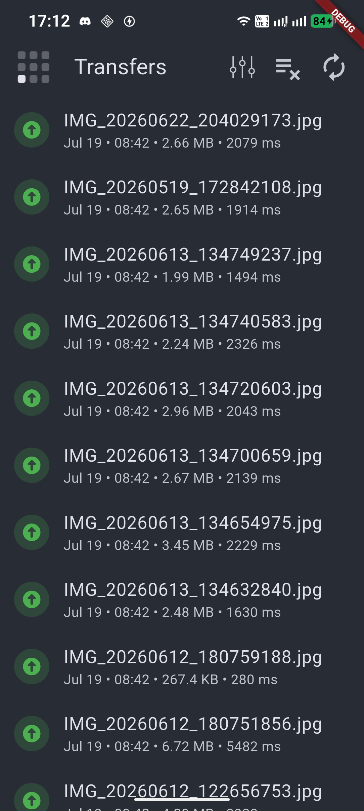
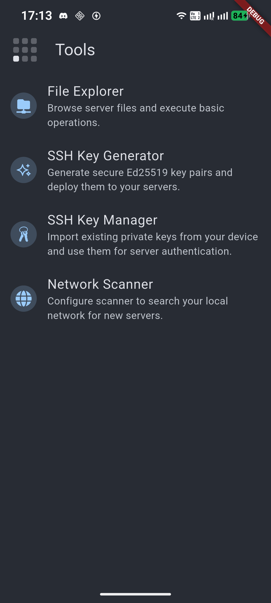
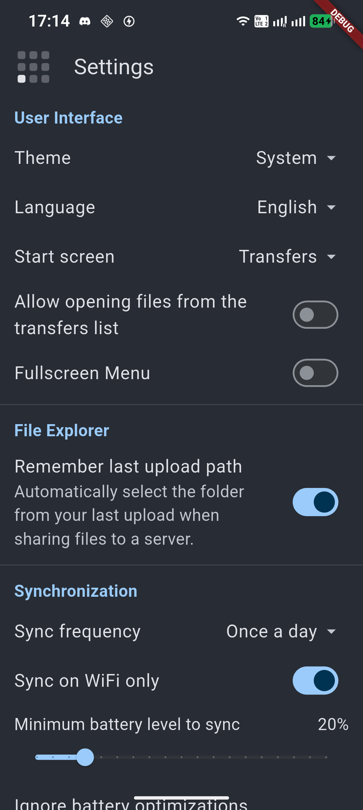

import HeadingWithIcon from '@reusables/HeadingWithIcon.astro';
import ImageGrid from '@reusables/ImageGrid.astro'
import ImagePreview from '@reusables/ImagePreview.astro'

<ImagePreview />

<HeadingWithIcon icon="game-icons:dwarf-helmet" title="Syncore" />

**Syncore** is a high-performance [Android application](https://www.android.com/) designed for automatic synchronization 
of local files and folders with remote servers using the [SFTP/SSH protocol](https://en.wikipedia.org/wiki/SSH_File_Transfer_Protocol). It is built for reliability, speed, and providing users with full control over their data transfers. 

<ImageGrid>
  
  
  
  
</ImageGrid>

## Key Features

- **Flexible Sync Directions:** Supports Bidirectional synchronization, as well as Upload-only or Download-only modes depending on your needs.
- **Turbo Mode:** Significantly accelerates transfer speeds by utilizing multi-threaded, parallel file uploading and downloading.
- **Automated Schedules:** Set up recurring synchronization cycles (e.g., every few hours) to keep your data up to date automatically, without any manual intervention.
- **Built-in File Explorer:** Directly browse your remote servers, manage files, and navigate SFTP directory structures without leaving the app.
- **Secure Authentication:** Connect using standard passwords or secure SSH Private Keys with a built-in cryptographic key manager.
- **Reliable Background Sync:** Maintain continuous file transfers and directory scanning in the background, powered by robust system Foreground Services.

## Compatibility & OS Support

Syncore is primarily optimized for **Linux-based servers** to take full advantage of native SSH/SFTP capabilities and file structures. However, a large portion of its features remains fully compatible with **Windows-based SFTP servers**.

## What is it for?

Syncore is the perfect tool for users with their own NAS, VPS, or private servers who want to break free from public cloud limitations. It is excellent for:
- Creating automated, secure backups from your Android device's local storage to a private server.
- Conveniently downloading large server assets and files directly to your smartphone.
- Reliably replicating and updating directories between your mobile device and various server environments over a secure SSH tunnel.
